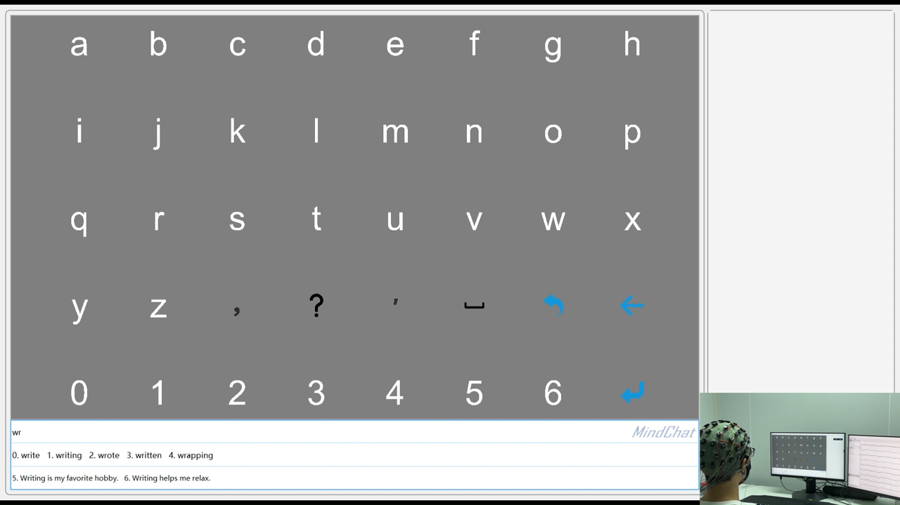

# MindChat

## Overview

This is a python implementation of MindChat, an SSVEP-based BCI speller enhanced by LLMs. The BCI system consists of two phases including the calibration and feedback stages. In the calibration stage, subjects are instructed to attend to the cued SSVEP stimuli. After the decoding model has been calibrated, in the feedback stage,  copy-spelling tasks are performed and users use MindChat to copy-spell targeted utterances. A demo video of MindChat is provided.

  
  

MindChat framework &emsp;&emsp;&emsp;&emsp;&emsp;&emsp;&emsp;&emsp;&emsp;&emsp;&emsp;&emsp; MindChat snapshot

## Dependencies

The system is mainly developed with the PyQt6 (6.4.2) framework along with mainstream data science and EEG-processing packages including numpy (1.22.3), scipy (1.8.0), pylsl (1.16.0), mne (1.2.2), pyqtgraph (0.13.0), openai (1.37.1), etc. A python interpreter version of 3.10 is recommended. 

## Usage

------

For a general case, a calibration stage is first performed to record subject-specific SSVEP data.

- [ ] Set up a EEG acquisition procedure and make sure real-time EEG signals are sent by [LSL](https://github.com/labstreaminglayer) outlets. Otherwise, you can run ***./utils/LSL_sender.py*** for a stream simulation.
- [ ] Configure the file ***./SSVEP_Calibration/cfg.py*** with your own experimental settings.
- [ ] Run the program with ***./SSVEP_Calibration/modules/client.py***.
- [ ] Record EEG data and Markers using [LabRecoder](https://github.com/labstreaminglayer/App-LabRecorder), and the file will be saved in the **.xdf** format.

------

Next,  a structed SSVEP dataset should be made and decoding models are trained.

- [ ] Train subject-specific models with the **algorithms** module. Specifically, FBECCA are implemented. It is straightforward to train and just take note of the corresponding configurations.

- [ ] Put pretrained model files into ***./SSVEP_Feedback/resources/***. An example decoding model of one subject is provided.

------

Now, we are ready to operate MindChat.
- [ ] Set up a EEG acquisition procedure and make sure real-time EEG signals are sent by [LSL](https://github.com/labstreaminglayer) outlets. Otherwise, you can run ***./utils/LSL_sender.py*** for a stream simulation.
- [ ] Check ***./SSVEP_Feedback/cfg.py*** for a necessary configuration.
- [ ] Run the file ***./SSVEP_Feedback/modules/chatbot_server.py*** to start a chatbot server.
- [ ] Run the file ***./SSVEP_Feedback/modules/decoder_server.py*** to start a decoding server.
- [ ] Run the file ***./SSVEP_Feedback/modules/client.py*** to perform real-time MindChat control!
